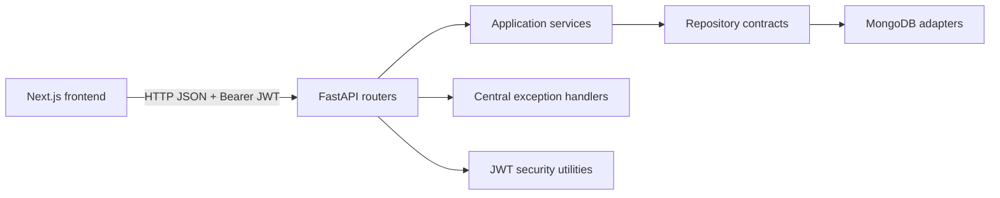
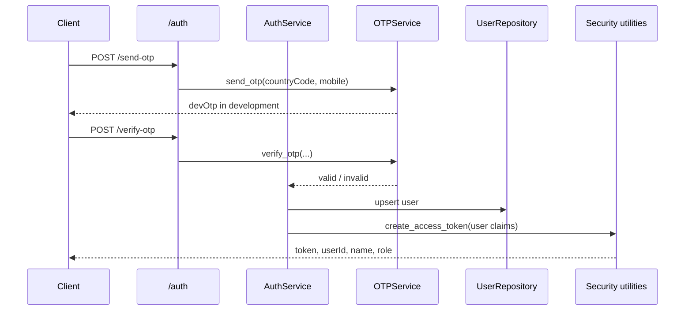
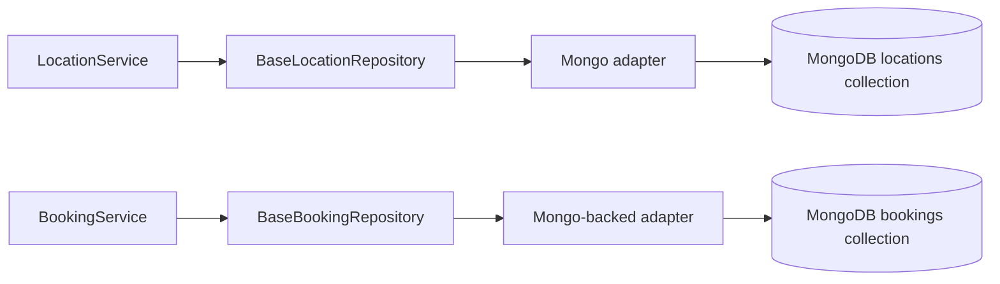

# Smart Tour Backend Architecture

This document describes the current FastAPI backend, its low-level design, data contracts, design patterns, and the persistence gap that must be closed before production use.

## 1. Backend Responsibilities

The backend owns:

- OTP-style authentication and JWT session creation.
- User identity and role checks.
- Destination listing, search, filtering, sorting, and detail data.
- Similar-destination recommendations returned with a detail response.
- Booking creation, user booking history, admin booking listing, and status transitions.
- Validation and consistent application error responses.

The frontend is a consumer of these contracts. It should not derive user identity, booking ownership, or authorization decisions.

## 2. Runtime Architecture



The backend uses a layered modular-monolith structure:

```text
backend/app/
  main.py                 Application assembly and startup seeding
  api/                    HTTP routers and dependency wiring
  services/               Business use cases
  repositories/           Repository contracts and current implementations
  adapters/               Storage-specific adapter implementations
  schemas/                Pydantic request and response models
  auth/                   OTP provider abstraction and development provider
  core/                   Configuration, JWT, dependencies, errors
  db/                     Development seed data
  state/                  Booking state machine
```

## 3. Request Flow

Every request follows this path:

```text
HTTP request
  -> FastAPI router
  -> Pydantic validation
  -> authentication dependency, when protected
  -> application service
  -> repository interface
  -> storage adapter
  -> response schema
  -> HTTP JSON response
```

The router should remain thin. Business rules belong in services, and storage access belongs behind repository interfaces.

## 4. Modules and Responsibilities

### `main.py`

`create_app()` assembles the application:

- Creates the `FastAPI` instance.
- Configures CORS.
- Registers exception handlers.
- Mounts `auth`, `locations`, `bookings`, and `admin` routers.
- Seeds development locations during startup.
- Exposes `GET /health`.

### `api/`

Routers translate HTTP input into service calls:

- `auth.py`: send and verify OTP.
- `locations.py`: list, read, create, update, and delete destinations.
- `bookings.py`: create a booking and list the current user's bookings.
- `admin.py`: list all bookings for an admin.

Routers do not access dictionaries, database collections, or JWT implementation details directly.

### `services/`

Services contain use-case behavior:

- `AuthService` validates OTP results, upserts a user, and creates a JWT.
- `LocationService` filters and sorts locations, builds summaries, and attaches similar locations to detail responses.
- `BookingService` verifies the destination, derives the user from the JWT dependency, creates bookings, and enforces status transitions.

### `repositories/` and `adapters/`

`BaseLocationRepository` and `BaseBookingRepository` define storage contracts. Services depend on these contracts instead of concrete storage classes.

`MongoLocationRepository` is connected to the `locations` collection. The user and booking repositories are connected to the `users` and `bookings` collections respectively.

### `auth/`

`OTPService` is the provider abstraction. `MockOTPService` is the development implementation used by `AuthService`.

This is strategy-like dependency injection:

```python
auth_service = AuthService(otp_service=real_sms_provider)
```

The service can use a real SMS provider later without changing the router or authentication use case.

### `state/`

`BookingState` implements the State pattern for booking status transitions.

Allowed transitions:

```text
PENDING   -> CONFIRMED
PENDING   -> CANCELLED
CONFIRMED -> CANCELLED
CANCELLED -> no further transition
```

The state object prevents invalid changes from being accepted by the service.

## 5. Design Pattern Map

| Pattern | Where used | Purpose |
|---|---|---|
| Layered architecture | `api -> services -> repositories` | Keeps HTTP, business rules, and storage concerns separate |
| Repository | `BaseLocationRepository`, `BaseBookingRepository` | Allows services to work against a storage contract |
| Adapter | `MongoLocationRepository` | Gives the service a storage-shaped interface while hiding implementation details |
| Strategy / dependency injection | `OTPService` and `MockOTPService` | Allows development OTP and real SMS providers to be swapped |
| State | `BookingState` | Controls legal booking status transitions |
| Dependency injection | FastAPI `Depends`, service constructors | Supplies auth and repository dependencies at boundaries |
| DTO / schema validation | `backend/app/schemas` | Validates request data and defines response contracts |
| Composition root | `main.py` and module-level service instances | Assembles the application dependencies |

There is no separate factory or unit-of-work implementation currently. Adding one should wait until a real database transaction boundary is required.

## 6. Authentication and Authorization Flow



Protected requests must include:

```text
Authorization: Bearer <jwt>
```

`get_current_user()` decodes the token and requires these claims:

- `userId`
- `name`
- `role`
- `countryCode`
- `mobile`

`require_admin()` calls `get_current_user()` and rejects users whose role is not `ADMIN`.

Important development limitation: `OTPService.verify_otp()` currently returns true for any non-empty OTP. This is suitable only for a demo and must be replaced by an expiring, provider-backed OTP verification flow.

## 7. API Contract

Base URL:

```text
http://localhost:8000
```

### Health

```http
GET /health
```

Response:

```json
{"status": "ok"}
```

### Authentication

```http
POST /auth/send-otp
Content-Type: application/json
```

```json
{
  "name": "Deepanshu",
  "countryCode": "+91",
  "mobile": "9876543210"
}
```

```http
POST /auth/verify-otp
Content-Type: application/json
```

```json
{
  "name": "Deepanshu",
  "countryCode": "+91",
  "mobile": "9876543210",
  "otp": "123456",
  "role": "USER"
}
```

### Locations

```http
GET /locations?page=1&limit=10&search=goa&type=Beach&sort=rating_desc
GET /locations/{projectId}
POST /locations                 # ADMIN only
PUT /locations/{projectId}      # ADMIN only
DELETE /locations/{projectId}   # ADMIN only
```

`GET /locations` returns paginated `LocationSummary` records. `GET /locations/{projectId}` returns the complete location plus `similarLocations` in the same response.

### Bookings

```http
POST /bookings
GET /bookings/my
GET /admin/bookings              # ADMIN only
```

Create request:

```json
{
  "projectId": 101,
  "bookingDate": "2026-12-20",
  "numberOfPeople": 2
}
```

The server derives `userId` from the JWT. The client must not be trusted to submit ownership fields.

## 8. Current Pydantic Schemas

### Location schema

```text
LocationImage
  url: str
  alt: str

LocationHero
  title: str
  description: str
  image: str

LocationFAQ
  question: str
  answer: str

LocationBase
  projectId: int >= 1
  type: str
  name: str
  shortDescription: str
  description: str
  rating: float 0..5
  reviewCount: int >= 0
  location: str
  hero: LocationHero
  whyChooseTitle: str
  whyChooseDescription: str
  images: list[LocationImage]
  faqs: list[LocationFAQ]
  imageUrl: str

LocationSummary
  projectId: int
  type: str
  name: str
  shortDescription: str
  imageUrl: str
  rating: float
  reviewCount: int
  location: str

LocationDetail
  LocationBase fields
  similarLocations: list[LocationSummary]
```

### Booking schema

```text
BookingCreateRequest
  projectId: int >= 1
  bookingDate: date
  numberOfPeople: int 1..20

BookingResponse
  id: str
  userId: str
  projectId: int
  locationName: str
  bookingDate: date
  numberOfPeople: int
  status: PENDING | CONFIRMED | CANCELLED

BookingListResponse
  data: list[BookingResponse]
```

### Authentication schema

```text
SendOtpRequest
  name: str, 2..80 characters
  countryCode: str, 1..8 characters
  mobile: str, 6..15 characters

VerifyOtpRequest
  SendOtpRequest fields
  otp: str, 4..8 characters
  role: str, default USER

AuthResponse
  token: str
  userId: str
  name: str
  role: str

CurrentUser
  userId: str
  name: str
  role: str
  countryCode: str
  mobile: str
```

## 9. Persistence Design

The backend now persists data in local MongoDB by default:

```text
MONGO_URI=mongodb://127.0.0.1:27017
MONGO_DATABASE=smart_tour
```

The repositories use these collections:

- `smart_tour.locations`
- `smart_tour.users`
- `smart_tour.bookings`

`seed_data()` runs at startup and uses upsert behavior for locations. It does not delete existing records. Users and bookings are written through their repositories and survive backend restarts.

## 10. Data That Should Exist in a Real Database

The minimum production model should have three collections or equivalent tables.

### `users`

```json
{
  "_id": "uuid",
  "name": "Deepanshu",
  "countryCode": "+91",
  "mobile": "9876543210",
  "role": "USER",
  "createdAt": "2026-09-01T10:00:00Z",
  "updatedAt": "2026-09-01T10:00:00Z"
}
```

Recommended unique index:

```text
users(countryCode, mobile) UNIQUE
```

### `locations`

```json
{
  "projectId": 101,
  "type": "Beach",
  "name": "Goa",
  "shortDescription": "Beaches, nightlife, and easy coastal escapes.",
  "description": "Goa blends relaxed beaches, water sports, old forts, and a laid-back travel vibe.",
  "rating": 4.8,
  "reviewCount": 124,
  "location": "India",
  "hero": {
    "title": "Experience Goa",
    "description": "Explore beaches, nightlife, and coastal culture.",
    "image": "/placeholders/goa.svg"
  },
  "whyChooseTitle": "Why Choose Goa?",
  "whyChooseDescription": "It is ideal for short breaks, group travel, and beach-focused itineraries.",
  "images": [
    {"url": "/placeholders/goa.svg", "alt": "Goa beach"}
  ],
  "faqs": [
    {"question": "Is Goa family friendly?", "answer": "Yes."}
  ],
  "imageUrl": "/placeholders/goa.svg",
  "createdAt": "2026-09-01T10:00:00Z",
  "updatedAt": "2026-09-01T10:00:00Z"
}
```

Recommended indexes:

```text
locations(projectId) UNIQUE
locations(type)
locations(rating DESC)
```

### `bookings`

```json
{
  "_id": "uuid",
  "userId": "uuid",
  "projectId": 101,
  "locationName": "Goa",
  "bookingDate": "2026-12-20",
  "numberOfPeople": 2,
  "status": "CONFIRMED",
  "createdAt": "2026-09-01T10:00:00Z",
  "updatedAt": "2026-09-01T10:00:00Z"
}
```

Recommended indexes:

```text
bookings(userId, createdAt DESC)
bookings(projectId, bookingDate)
bookings(status)
```

For production, `locationName` can be retained as a snapshot for historical display, but `projectId` remains the canonical destination reference.

## 11. Recommended Persistence Design

Keep the service layer unchanged and replace only concrete repository implementations:



Implementation sequence:

1. Configure `MONGO_URI` and `MONGO_DATABASE` for the target environment.
2. Keep one shared Mongo client and close it during application shutdown.
3. Keep repository operations behind the existing base repository contracts.
4. Run seed upserts only for known development seed records.
5. Add migrations or deployment-time index management as the schema evolves.
6. Add repository integration tests against a disposable MongoDB instance.

## 12. Error Handling

Application errors use `AppError` and return:

```json
{
  "message": "Location not found",
  "details": {}
}
```

Validation errors return HTTP `422` with field-level details. Unhandled errors return HTTP `500` and are logged server-side without exposing internal details.

## 13. Current Limitations and Risks

- MongoDB persistence is now implemented, but production backup and migration procedures are not yet configured.
- Development startup seeding updates known location IDs but does not remove obsolete records.
- OTP verification accepts any non-empty OTP.
- The JWT default secret is a development fallback and must be replaced through environment configuration.
- There is no rate limiting for OTP requests.
- There are no database migrations or repository integration tests.
- The backend README references `requirements.txt`, but that file is currently missing and should be added before onboarding or deployment.
- CORS currently allows one configured frontend origin through `FRONTEND_ORIGIN`.

## 14. Local Development

```bash
cd backend
pip install -r requirements.txt
uvicorn app.main:app --reload --port 8000
```

Useful checks:

```bash
curl http://localhost:8000/health
curl http://localhost:8000/locations
curl http://localhost:8000/locations/101
```

The detail endpoint should return the destination and a `similarLocations` array in one response.
